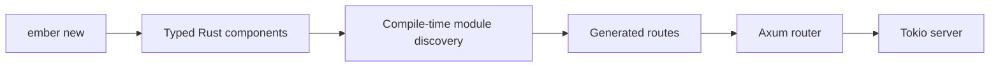

# Ember documentation

Welcome to the Ember documentation. Ember is a batteries-included web
application framework for Rust built on familiar ecosystem crates such as
Axum, Tokio, Tower, Serde, and `tracing`.

## Start here

- [Getting started](getting-started.md) — create and run your first Ember
  application.
- [Architecture](architecture.md) — understand the workspace, application
  model, and design boundaries.
- [Generated code](generated-code.md) — see what `ember new` creates and how
  source discovery works.
- [Dependency graph guide](guides/dependency-graph.md) — use the opt-in typed
  build-time graph.
- [Publishing](publishing.md) — configure and trigger a crates.io release.
- [Contributing](contributing.md) — build the workspace and make a focused
  contribution.

## Current scope

Ember is currently an MVP. The most complete path covers typed components,
generated routes, an Axum router, configuration loading, structured logging,
and a Tokio server. The CLI also generates starters for web applications, JSON
APIs, services, and modular monoliths.

The documentation describes the current implementation and calls out current
limitations where they affect how an application is built.

## Workspace crates

| Crate | Responsibility |
| --- | --- |
| `ember` | Application-facing facade and prelude |
| `ember-framework` | Application-facing facade; imported as `ember` |
| `ember-framework-core` | Framework-neutral lifecycle and metadata types |
| `ember-framework-foundation` | Logging, backtraces, phases, and shutdown policy |
| `ember-framework-macros` | Procedural macros for components and routes |
| `ember-framework-web` | Axum integration, routing, limits, and shutdown |
| `ember-framework-config` | YAML, YML, properties, profiles, and environment overrides |
| `ember-framework-build` | Build-time module and dependency-graph discovery |
| `ember-framework-cli` | Project generation, development, and checks; installs `ember` |
| `ember-framework-actuator` | Optional health, readiness, info, and metrics endpoints |
| `ember-framework-security` | Optional bearer, Basic, and JWT authentication |
| `ember-framework-scheduler` | Optional scheduled task support |
| `ember-framework-bootui` | Optional local development dashboard |

The `ember-framework` facade can be used from application code under the
dependency key `ember`, so imports remain `use ember::prelude::*`.
