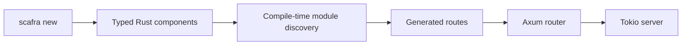

# Scafra documentation

Welcome to the Scafra documentation. Scafra is a batteries-included web
application framework for Rust built on familiar ecosystem crates such as
Axum, Tokio, Tower, Serde, and `tracing`.

## Start here

- [Getting started](getting-started.md) — create and run your first Scafra
  application.
- [Architecture](architecture.md) — understand the workspace, application
  model, and design boundaries.
- [Generated code](generated-code.md) — see what `scafra new` creates and how
  source discovery works.
- [HTTP security](security.md) — configure authentication and define
  controller-level and route-level authorization policies.
- [Dependency graph guide](guides/dependency-graph.md) — understand the typed
  graph used by standard startup and the custom build-script route.
- [Publishing](publishing.md) — configure and trigger a crates.io release.
- [Contributing](contributing.md) — build the workspace and make a focused
  contribution.

## Current scope

Scafra is currently an MVP. The most complete path covers typed components,
generated routes, an Axum router, configuration loading, structured logging,
and a Tokio server. The CLI also generates starters for web applications, JSON
APIs, services, and modular monoliths.

The documentation describes the current implementation and calls out current
limitations where they affect how an application is built.

## Workspace crates

| Crate | Responsibility |
| --- | --- |
| `scafra` | Application-facing facade; imported as `scafra` |
| `scafra-core` | Framework-neutral lifecycle and metadata types |
| `scafra-foundation` | Logging, backtraces, phases, and shutdown policy |
| `scafra-macros` | Procedural macros for components and routes |
| `scafra-web` | Axum integration, routing, limits, and shutdown |
| `scafra-config` | YAML, YML, properties, profiles, and environment overrides |
| `scafra-build` | Build-time module and dependency-graph discovery |
| `scafra-cli` | Project generation, development, and checks; installs `scafra` |
| `scafra-actuator` | Optional health, readiness, info, and metrics endpoints |
| `scafra-security` | Optional bearer, Basic, and JWT authentication |
| `scafra-scheduler` | Optional scheduled task support |
| `scafra-bootui` | Optional local development dashboard |

The `scafra` facade can be used from application code under the
dependency key `scafra`, so imports remain `use scafra::prelude::*`.
