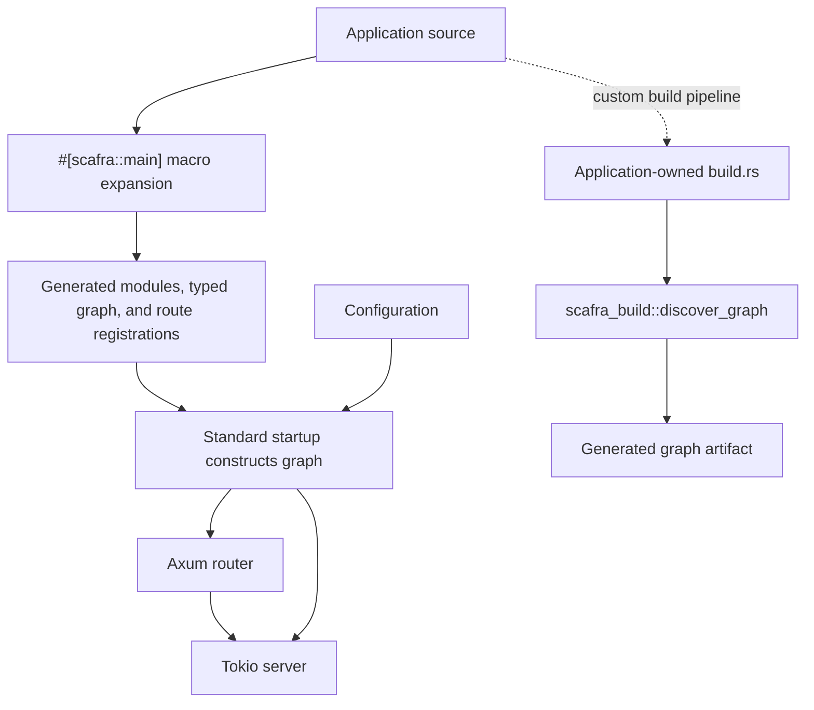
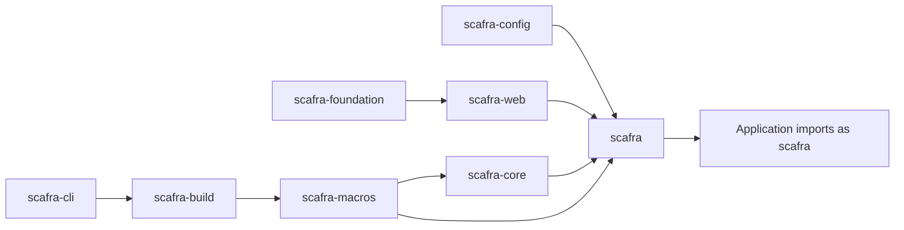

# Architecture

## Design goal

Scafra supplies the application infrastructure that is repetitive in many web
services while preserving Rust's explicit types, compiler diagnostics, and
ecosystem interoperability.

The current runtime path is:

```text
typed components
    -> generated module and route registrations
    -> application configuration and lifecycle
    -> Axum router
    -> Tokio server
```



The upper path is the standard `#[scafra::main]` flow: the macro discovers
application components and generates the typed graph during compilation, then
the generated graph constructs component instances during startup. The lower
path is optional and lets an application-owned build pipeline generate a graph
artifact with `scafra_build::discover_graph`. See the
[typed dependency graph guide](guides/dependency-graph.md) for graph behavior
and supported declarations.

## Workspace boundaries

The workspace is split into focused packages. Their published names start
with `scafra-`; dependency aliases retain the shorter crate names
used in Rust source. Framework-neutral types live in the core and foundation
packages; HTTP concerns live in the web package; configuration is handled by
the config package; project conventions are implemented by the build and CLI
packages.

This separation keeps the application facade convenient while allowing lower
layers to remain reusable and testable.



## Compile-time composition

Scafra's standard `#[scafra::main]` path discovers application components and
generates the typed dependency graph during compilation. Generated constructors
compose the graph during startup, so injected dependencies do not need
`Default`. Shared dependencies use explicit `Arc<T>` fields. A missing
dependency is diagnosed at compile time rather than through a late runtime
lookup.

The standard path uses static route descriptors. Scafra does not use runtime
filesystem scanning, reflection, or a global service locator. The separate
`scafra_build::discover_graph` API remains available when an application owns a
custom build pipeline; see the
[typed dependency graph guide](guides/dependency-graph.md).

## Runtime responsibilities

The standard runner owns configuration loading, logging initialization,
startup validation, route registration, listening, and graceful shutdown.
Applications can use `build_router()` or the Axum/Tower re-exports when they
need a custom server boundary. Replacing the standard runner transfers those
responsibilities to the application.

## Current implementation

The current implementation includes the HTTP path, project generation,
configuration, logging, optional operational endpoints, security options, and
scheduling. The standard starter uses `#[scafra::main]`; the
[typed dependency graph guide](guides/dependency-graph.md) covers its generated
graph and the optional custom build-script route.
