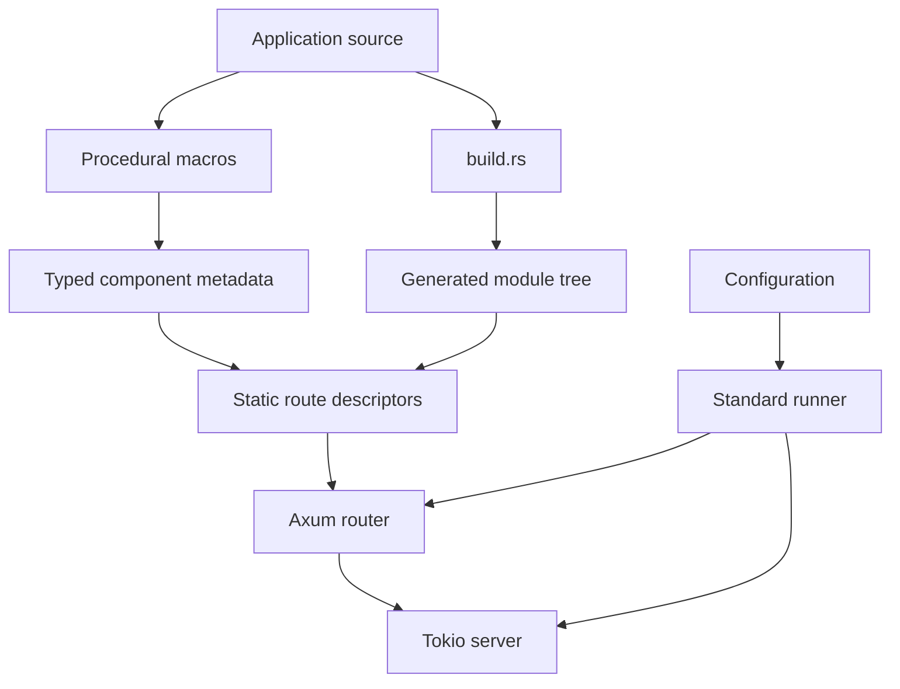
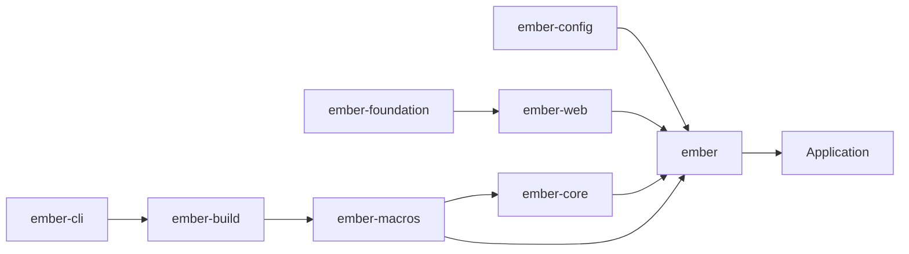

# Architecture

## Design goal

Ember supplies the application infrastructure that is repetitive in many web
services while preserving Rust's explicit types, compiler diagnostics, and
ecosystem interoperability.

The current runtime path is:

```text
typed components
    -> generated module and route registrations
    -> application configuration and lifecycle
    -> Axum router
    -> Tokio server
```



## Workspace boundaries

The workspace is split into focused crates. Framework-neutral types live in
`ember-core` and `ember-foundation`; HTTP concerns live in `ember-web`;
configuration is handled by `ember-config`; and project conventions are
implemented by `ember-build` and `ember-cli`.

This separation keeps the application facade convenient while allowing lower
layers to remain reusable and testable.



## Compile-time composition

Ember uses procedural macros and build-time source discovery to generate typed
registrations. Constructors use Rust types and `Default`-based dependency
construction where supported. A missing dependency is therefore a compiler
error rather than a late runtime lookup failure.

The default path uses static route descriptors. It does not perform runtime
filesystem scanning, reflection-based discovery, or string-key service lookup.

## Runtime responsibilities

The standard runner owns configuration loading, logging initialization,
startup validation, route registration, listening, and graceful shutdown.
Applications can use `build_router()` or the Axum/Tower re-exports when they
need a custom server boundary. Replacing the standard runner transfers those
responsibilities to the application.

## Current and future scope

The current MVP includes the HTTP path, project generation, configuration,
logging, optional operational endpoints, security options, and scheduling.
Typed graph integration, richer lifecycle composition, database adapters, and
additional shape-specific middleware remain roadmap work.
