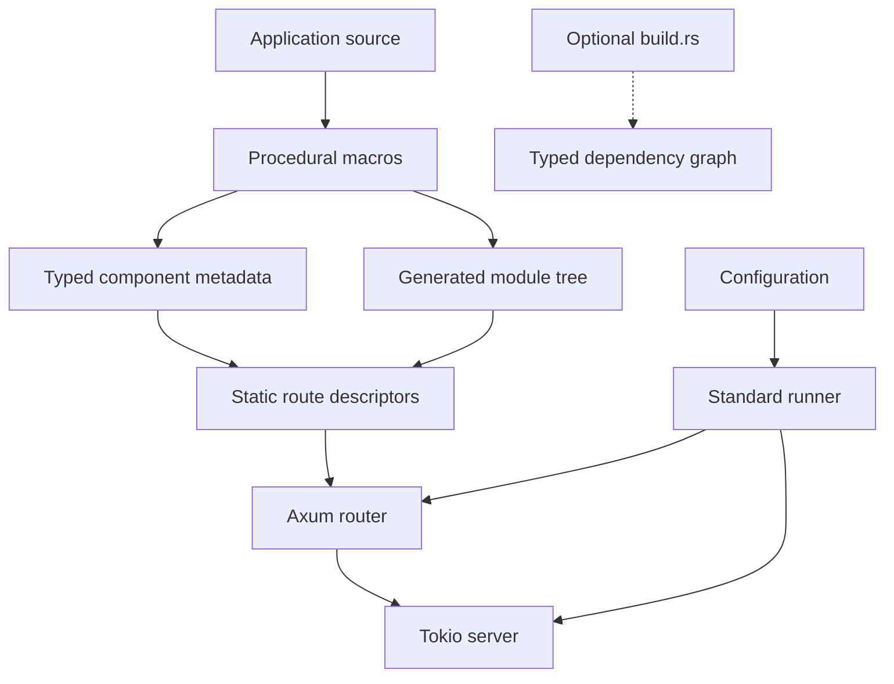
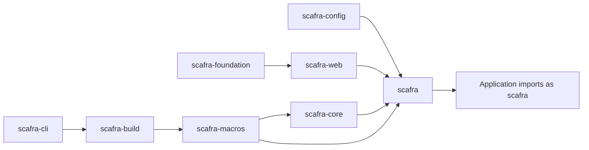

# Architecture

## Design goal

Scafra supplies the application infrastructure that is repetitive in many web
services while preserving Rust's explicit types, compiler diagnostics, and
ecosystem interoperability.

The current runtime path is:

```text
typed components
    -> generated module and route registrations
    -> application configuration and lifecycle
    -> Axum router
    -> Tokio server
```



## Workspace boundaries

The workspace is split into focused packages. Their published names start
with `scafra-`; dependency aliases retain the shorter crate names
used in Rust source. Framework-neutral types live in the core and foundation
packages; HTTP concerns live in the web package; configuration is handled by
the config package; project conventions are implemented by the build and CLI
packages.

This separation keeps the application facade convenient while allowing lower
layers to remain reusable and testable.



## Compile-time composition

Scafra uses procedural macros to discover application modules and generate typed
registrations during compilation. The standard startup path calls generated
constructors directly, so injected dependencies do not need `Default`. Shared
dependencies use explicit `Arc<T>` fields. A missing dependency is a compiler
error rather than a late runtime lookup failure.

The default path uses static route descriptors. It does not perform runtime
filesystem scanning, reflection-based discovery, or string-key service lookup.
The separate `scafra_build::discover_graph` function is opt-in and requires an
application-owned build script.

## Runtime responsibilities

The standard runner owns configuration loading, logging initialization,
startup validation, route registration, listening, and graceful shutdown.
Applications can use `build_router()` or the Axum/Tower re-exports when they
need a custom server boundary. Replacing the standard runner transfers those
responsibilities to the application.

## Current implementation

The current implementation includes the HTTP path, project generation,
configuration, logging, optional operational endpoints, security options, and
scheduling. The typed graph is available through the opt-in
`scafra_build::discover_graph` build-script function; the standard starter does
not enable it automatically.
