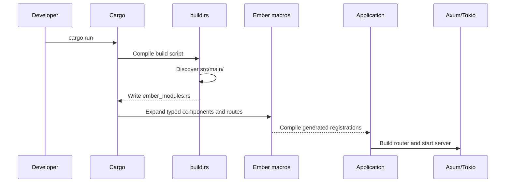

# Generated projects

The `ember new` command creates ordinary, inspectable Rust files. It does not
generate a hidden application bundle or require a special editor.

## Typical layout

```text
my-app/
├── Cargo.toml
├── build.rs
├── README.md
└── src/
    ├── main.rs
    ├── main/
    │   ├── controllers/
    │   ├── services/
    │   ├── repositories/
    │   ├── beans/
    │   ├── config/
    │   ├── models/
    │   └── errors/
    └── resources/
        └── application.yaml
```

The monolith starter additionally creates a bounded module under
`src/main/modules/`.

## Source discovery

`build.rs` calls `ember_build::discover("src/main")`. Ember writes the
generated module tree to Cargo's `OUT_DIR`. New Rust files under `src/main/`
can therefore participate without manually adding every `mod` declaration to
`main.rs`.

The generated files remain normal Rust code. Visibility, imports, compiler
diagnostics, and application ownership are still explicit.

## From source file to route



## Customization

The starter is a convention, not a lock-in. Replace controllers, services,
providers, configuration, or the entry point as the application evolves. If
the standard runner is replaced, the application must include the generated
module file or declare equivalent modules manually so static registrations stay
linked.
